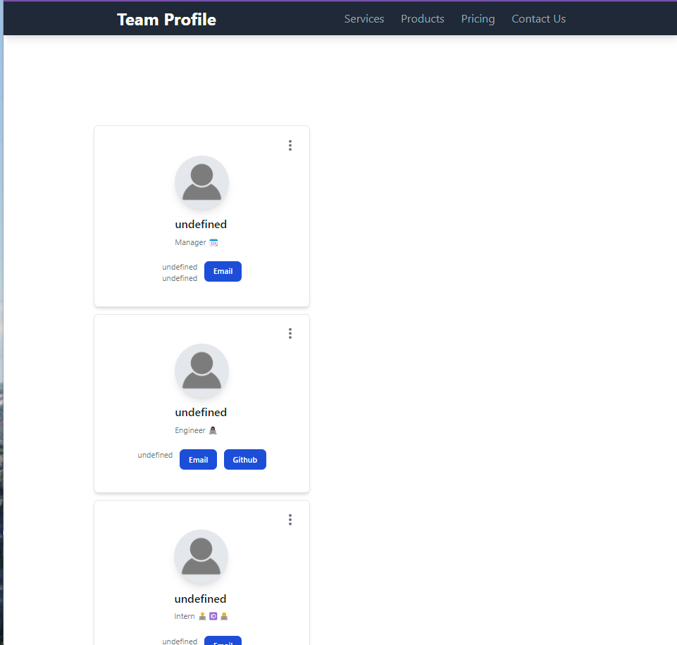

# Team Profile Generator
### OSU Bootcamp Challenge 10
---------------------------------------------------
## Devloped By: Megan Beekman (2022), [GitHub profile --->](https://github.com/meganbeek98)
    developed using: Node.js, Git, npm, Inquirer, Jest

---------------------------------------------------

## About:  
    This project is a Node.js command-line application that takes in information about employees on a software engineering team and generates an HTML webpage that displays summaries for each person.

---------------------------------------------------

## User Story:  
    I WANT to generate a webpage that displays my team's basic info
    SO THAT I have quick access to their emails and GitHub profilesGIVEN a command-line application that accepts user input
    WHEN I am prompted for my team members and their information
    THEN an HTML file is generated that displays a nicely formatted team roster based on user input
    WHEN I click on an email address in the HTML
    THEN my default email program opens and populates the TO field of the email with the address
    WHEN I click on the GitHub username
    THEN that GitHub profile opens in a new tab
    WHEN I start the application
    THEN I am prompted to enter the team manager’s name, employee ID, email address, and office number
    WHEN I enter the team manager’s name, employee ID, email address, and office number
    THEN I am presented with a menu with the option to add an engineer or an intern or to finish building my team
    WHEN I select the engineer option
    THEN I am prompted to enter the engineer’s name, ID, email, and GitHub username, and I am taken back to the menu
    WHEN I select the intern option
    THEN I am prompted to enter the intern’s name, ID, email, and school, and I am taken back to the menu
    WHEN I decide to finish building my team
    THEN I exit the application, and the HTML is generated

-----------------------------------------------------

## Screencast and Screenshot(s):  

[Google Drive video link](https://drive.google.com/file/d/1d1bCKcj9VSelM7Z9HAVeGEs4ox7ScaS-/view)

<iframe src="https://drive.google.com/file/d/1d1bCKcj9VSelM7Z9HAVeGEs4ox7ScaS-/preview" width="640" height="480"></iframe>

### *** Video may be too long to view on GitHub, please use the links provided above to view the demo ***

 

Homepage
</img>

---------------------------------------------------

## Links:  

[GitHub Repository Link](https://github.com/meganbeek98/team-profile-generator.git)

----------------------------------------------------

## Some resources used to develop:  
    - OSU Coding Bootcamp (2022) -- modules, and the instructors & TA's
    - Slack (including 'ASKBCS' assistants)
    - Github
    - MDN Web Docs
    - stackoverflow
    - w3schools.com
    - Chrome Dev Tools
    - And last, but certainly not least --> Google!

----------------------------------------------------
----------------------------------------------------